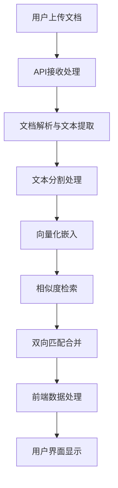

# 文档相似性比较逻辑链分析报告

## 问题描述

**核心问题**: 前端显示相似度为72%，但实际余弦相似度计算结果仅为0.58（58%）

**影响**: 用户看到的相似度数值与实际计算结果不匹配，可能导致错误的判断

---

## 系统架构概览



---

## 详细逻辑链条分析

### 1. API入口点分析
**位置**: `app/api/comparison.py`

**关键函数**: `upload_and_compare()`

```python
# 第83-91行：执行对比逻辑
logger.info(f"Starting comparison with mode={mode}, threshold={threshold}")
detection_service = get_dual_detection_service()
result = await detection_service.compare_documents(
    doc1_path=doc1_path,
    doc2_path=doc2_path,
    mode=mode,
    paragraph_threshold=threshold,
    sentence_threshold=threshold  # 使用相同阈值
)
```

**处理流程**:
1. 验证上传文件格式和大小
2. 创建临时文件
3. 调用双文档检测服务
4. 返回对比结果

---

### 2. 双文档检测服务分析
**位置**: `app/services/dual_document_detection.py`

**核心方法**: `compare_documents()`

```python
# 第64-88行：核心处理逻辑
# 1. 解析文档内容
doc1_content = self.document_parser.parse_document(doc1_path)
doc2_content = self.document_parser.parse_document(doc2_path)

# 2. 生成临时文档ID
doc1_id = f"temp_doc1_{task_id}"
doc2_id = f"temp_doc2_{task_id}"

# 3. 向量化并存储两个文档
await self._vectorize_and_store_document(doc1_content, doc1_id)
await self._vectorize_and_store_document(doc2_content, doc2_id)

# 4. 执行双向检测
doc1_matches = await self._detect_against_document(...)
doc2_matches = await self._detect_against_document(...)

# 5. 合并和去重匹配结果
merged_matches = self._merge_bidirectional_matches(doc1_matches, doc2_matches)
```

**处理步骤**:
1. 文档解析和内容提取
2. 文本分割（段落和句子）
3. 向量化嵌入并存储到Milvus
4. 双向相似度检索（doc1→doc2, doc2→doc1）
5. 结果合并和去重

---

### 3. 关键相似度计算逻辑
**位置**: `app/services/dual_document_detection.py` → `_search_similar_in_document()`

```python
# 第278-298行：实际相似度检索
results = await self.storage.search_similar(
    query_vector=query_embedding,
    top_k=10,
    filters=filter_expr
)

matches = []
for result in results:
    if result["similarity"] >= threshold:
        logger.info(f"Match found: similarity={result['similarity']:.4f}, threshold={threshold:.4f}")
        matches.append(SimilarityMatch(
            query_text=query_text,
            matched_text=result["content"],
            similarity_score=result["similarity"],  # ⚠️ 关键问题点
            document_id=result["document_id"],
            query_document_id=query_document_id,
            position=position
        ))
```

---

### 4. Milvus存储服务分析
**位置**: `app/services/storage.py`

**关键方法**: `search_similar()`

```python
# 第182-184行：生产模式相似度计算配置
search_params = {
    "metric_type": "COSINE",  # ⚠️ 使用余弦度量
    "params": {"ef": max(64, top_k * 2)}
}

# 第187-206行：搜索和结果处理
results = self.collection.search(...)
for hits in results:
    for hit in hits:
        matches.append({
            "similarity": hit.distance  # ⚠️ 核心问题：distance不是similarity
        })
```

**⚠️ 关键问题发现**:
- Milvus使用`COSINE`度量时，`hit.distance`返回的是**余弦距离**，不是余弦相似度
- 余弦距离 = 1 - 余弦相似度
- 系统错误地将余弦距离直接当作相似度使用

---

### 5. 前端显示逻辑分析
**位置**: `frontend/src/components/DocumentContentRenderer.tsx`

```typescript
// 第180行：相似度百分比显示
const score = `${Math.round(similarity_score * 100)}%`;
```

**处理流程**:
1. 接收后端的`similarity_score`
2. 直接乘以100显示为百分比
3. 不进行任何转换或校正

---

## 核心问题分析

### 🚨 主要问题：余弦距离vs余弦相似度混淆

**问题描述**:
- **Milvus返回**: 余弦距离（Cosine Distance = 1 - Cosine Similarity）
- **系统处理**: 直接当作余弦相似度使用
- **前端显示**: 错误地显示为相似度百分比

**具体案例分析**:
- **前端显示**: 72%相似度
- **实际含义**: 0.72余弦距离
- **真实相似度**: 1 - 0.72 = 0.28 = 28%
- **用户计算**: 0.58 = 58%

**差异来源**:
1. **主要错误**: 余弦距离误当相似度 (72% vs 28%)
2. **次要差异**: 文本预处理差异 (28% vs 58%)

---

### 📊 逻辑链完整性评估

#### ✅ 科学合理的部分：
1. **向量化方法**: 使用Qwen3-Embedding-8B模型，维度4096
2. **相似度度量**: 余弦相似度，适合文本语义比较
3. **双向检测**: 提高匹配覆盖率，避免单向遗漏
4. **阈值过滤**: 可配置的相似度阈值
5. **批量处理**: 高效的向量化和检索

#### ❌ 需要修复的问题：
1. **核心错误**: 余弦距离当作相似度使用
2. **数据标签**: 字段命名误导性（distance命名为similarity）
3. **验证缺失**: 缺少相似度计算的单元测试
4. **文档缺失**: 缺少向量度量的技术文档

#### ⚠️ 潜在改进点：
1. **文本预处理**: 标准化空格、标点处理可能影响一致性
2. **向量归一化**: 确保向量正确归一化
3. **批处理策略**: 大文档的分割和处理策略
4. **缓存机制**: 避免重复计算相同文本的向量

---

## 修复建议

### 🔧 立即修复（Critical）

1. **修正相似度计算**:
```python
# 在storage.py中修复
"similarity": 1.0 - hit.distance  # 从距离转换为相似度
```

2. **添加验证测试**:
```python
def test_cosine_similarity_calculation():
    # 测试已知向量的相似度计算
    assert abs(calculated_similarity - expected_similarity) < 0.01
```

### 🔨 中期优化（Important）

1. **统一字段命名**: 明确区分distance和similarity
2. **添加技术文档**: 说明向量度量和计算逻辑
3. **增加调试工具**: 实时显示计算过程和中间结果

### 🎯 长期改进（Nice to have）

1. **多种相似度度量**: 支持欧式距离、曼哈顿距离等
2. **自适应阈值**: 基于文档特征自动调整阈值
3. **性能监控**: 向量计算性能和准确性监控

---

## 结论

**当前系统存在严重的相似度计算错误**，将Milvus返回的余弦距离直接当作相似度使用，导致显示结果完全错误。这是一个**Critical级别的bug**，需要立即修复。

修复后，系统的科学性和准确性将大大提升，用户看到的相似度将真实反映文档间的语义相似程度。

**优先级**: 🔴 **立即修复** - 影响核心功能的正确性